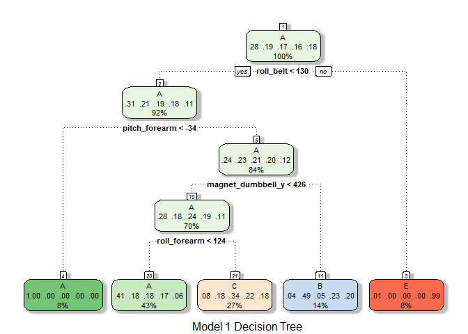
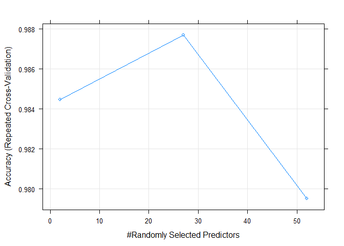
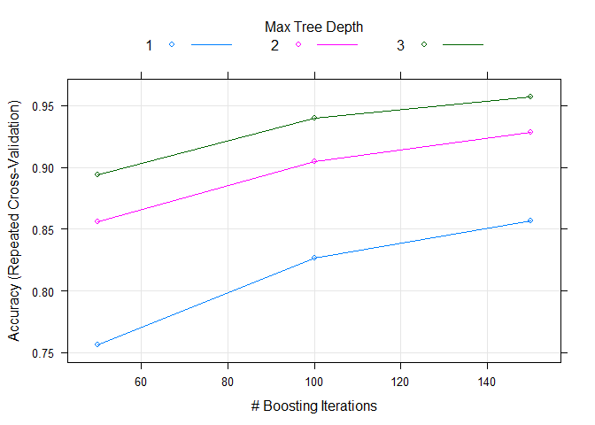
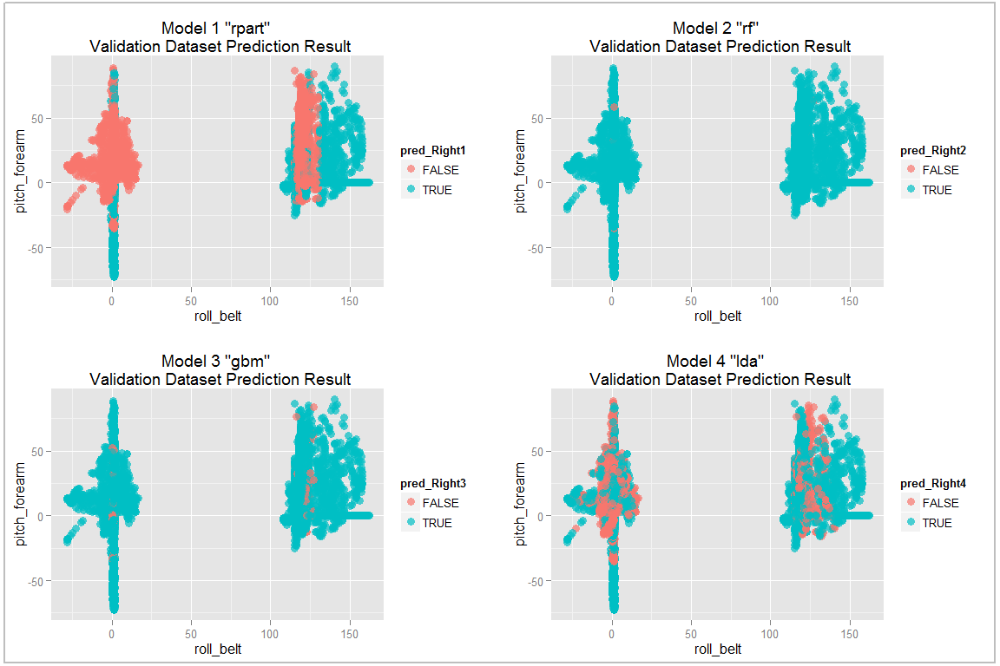

# Machine Learning and Weight Lifting Action Classification Prediction
Wong Wing Keng  
December 2015  

----  

###Executive Summary

This report will explore the **Weight Lifting Exercise Dataset** from [ [ Velloso et al., 2013 ] ](http://groupware.les.inf.puc-rio.br/har#weight_lifting_exercises) and attempts to build machine learning models. The best model is then chosen to be used to predict the manner in which a group of participants who performed barbell lifting exercise.  The prediction model will segregate their actions according to a pre-defined classification set i.e., Class A to E (based upon their weight lifting movement). The predicted result can possibly be further utilised to measure/reviews the correctness of the weight lifting exercise through other means or applications.

Additional reference: http://groupware.les.inf.puc-rio.br/har 
(*see the section on the Weight Lifting Exercise Dataset).  

In this report, different prediction models were tested. Each model's training process, prediction accuracy and out of sample errors were compared. The best performing model observed is the model which uses the **"Random Forest"** algorithm. The **"Random Forest"** model achieved an overall accuracy of **99.27%**. The detailed data exploration, model training and accuracy reviews are shown below. 

----  

###Background Information
Using devices such as Jawbone Up, Nike FuelBand, and Fitbit, it is now possible to collect a large amount of data about personal activity relatively inexpensively.     

In the Weight Lifting dataset, 6 participants were asked to perform barbell lifts correctly and incorrectly in 5 different ways. The five ways are exactly:

* According to the specification (Class A)  
* Throwing the elbows to the front (Class B)  
* Lifting the dumbbell only halfway (Class C)  
* Lowering the dumbbell only halfway (Class D)     
* Throwing the hips to the front (Class E)   

*Note: Only Class A corresponds to correct performance. 

Data were collected from accelerometers that were placed on the belt, forearm, arm, and dumbell of the participants. These formed the basis of the Weight Lifting data. 

----

###Data Loading and Basic Exploratory

2 pre-defined set of the weight lifting dataset (one for training set and the other as testing set) are made available online and will be used in the report.

####Training data set

Downloading and loading training dataset


```r
if(!dir.exists("./data")){dir.create("./data")}
training_url<-"https://d396qusza40orc.cloudfront.net/predmachlearn/pml-training.csv"
download.file(training_url, destfile="./data/pml-training.csv", method="auto")
training <- read.csv("./data/pml-training.csv", na.strings = c("NA", ""))
```

####Testing data set

Downloading and loading testing dataset


```r
testing_url<-"https://d396qusza40orc.cloudfront.net/predmachlearn/pml-testing.csv"
download.file(testing_url, destfile="./data/pml-testing.csv", method="auto")
testing <- read.csv("./data/pml-testing.csv", na.strings = c("NA", ""))
```


```r
dim(training); dim(testing)
```

```
## [1] 19622   160
```

```
## [1]  20 160
```

Both raw dataset has **160** columns. Differences is training dataset contains **19622** rows while testing dataset contains only **20** rows. 

High level review of the data structure (first 20 columns) shows the following:  


```r
str(training, list.len=20)
```

```
## 'data.frame':	19622 obs. of  160 variables:
##  $ X                       : int  1 2 3 4 5 6 7 8 9 10 ...
##  $ user_name               : Factor w/ 6 levels "adelmo","carlitos",..: 2 2 2 2 2 2 2 2 2 2 ...
##  $ raw_timestamp_part_1    : int  1323084231 1323084231 1323084231 1323084232 1323084232 1323084232 1323084232 1323084232 1323084232 1323084232 ...
##  $ raw_timestamp_part_2    : int  788290 808298 820366 120339 196328 304277 368296 440390 484323 484434 ...
##  $ cvtd_timestamp          : Factor w/ 20 levels "02/12/2011 13:32",..: 9 9 9 9 9 9 9 9 9 9 ...
##  $ new_window              : Factor w/ 2 levels "no","yes": 1 1 1 1 1 1 1 1 1 1 ...
##  $ num_window              : int  11 11 11 12 12 12 12 12 12 12 ...
##  $ roll_belt               : num  1.41 1.41 1.42 1.48 1.48 1.45 1.42 1.42 1.43 1.45 ...
##  $ pitch_belt              : num  8.07 8.07 8.07 8.05 8.07 8.06 8.09 8.13 8.16 8.17 ...
##  $ yaw_belt                : num  -94.4 -94.4 -94.4 -94.4 -94.4 -94.4 -94.4 -94.4 -94.4 -94.4 ...
##  $ total_accel_belt        : int  3 3 3 3 3 3 3 3 3 3 ...
##  $ kurtosis_roll_belt      : Factor w/ 396 levels "-0.016850","-0.021024",..: NA NA NA NA NA NA NA NA NA NA ...
##  $ kurtosis_picth_belt     : Factor w/ 316 levels "-0.021887","-0.060755",..: NA NA NA NA NA NA NA NA NA NA ...
##  $ kurtosis_yaw_belt       : Factor w/ 1 level "#DIV/0!": NA NA NA NA NA NA NA NA NA NA ...
##  $ skewness_roll_belt      : Factor w/ 394 levels "-0.003095","-0.010002",..: NA NA NA NA NA NA NA NA NA NA ...
##  $ skewness_roll_belt.1    : Factor w/ 337 levels "-0.005928","-0.005960",..: NA NA NA NA NA NA NA NA NA NA ...
##  $ skewness_yaw_belt       : Factor w/ 1 level "#DIV/0!": NA NA NA NA NA NA NA NA NA NA ...
##  $ max_roll_belt           : num  NA NA NA NA NA NA NA NA NA NA ...
##  $ max_picth_belt          : int  NA NA NA NA NA NA NA NA NA NA ...
##  $ max_yaw_belt            : Factor w/ 67 levels "-0.1","-0.2",..: NA NA NA NA NA NA NA NA NA NA ...
##   [list output truncated]
```

```r
###Sample check on total number of NAs
summary(training$max_picth_belt)
```

```
##    Min. 1st Qu.  Median    Mean 3rd Qu.    Max.    NA's 
##    3.00    5.00   18.00   12.92   19.00   30.00   19216
```

```r
summary(training$avg_roll_belt)
```

```
##    Min. 1st Qu.  Median    Mean 3rd Qu.    Max.    NA's 
##  -27.40    1.10  116.40   68.06  123.40  157.40   19216
```

\* It can be observed that multiple columns in the raw dataset actually contains empty data (**"NA"**s values). Random checks (see sample above) on these columns shows huge number of rows (>50% of total number of rows) are actually empty.

Additional check on zero covariates:


```r
###Near Zero Covariates
suppressMessages(library(caret))
nzlist<-nearZeroVar(training)
length(nzlist)
```

```
## [1] 43
```

There are  **43** features/columns that have very few unique values in the raw dataset. These would also required further processing.

----

###Data Cleaning and Further Exploration

The previously identified data columns with only few unique values ( or small variances) are considered to be bad predictors for usage in machine learning model building. These data columns will be removed.


```r
training<-training[, -nzlist]
testing<-testing[, -nzlist] # synchronize the same removal action on testing dataset
```

Since prediction cannot handle missing/empty data hence any remaining data columns with **NA** values will also be removed from the datasets. Data imputation is not performed as the amount of missing data is simply too big to have meaningful value replacement.


```r
nalist<-colnames(training[, colSums(is.na(training)) != 0]) ### Retrieve the column names
naindex<-which(names(training) %in% nalist) ### Retrieve the column indexes
training<-training[, -naindex] ###Remove the columns
testing<-testing[, -naindex] ###Remove the same columns from testing set
dim(training); dim(testing)
```

```
## [1] 19622    59
```

```
## [1] 20 59
```

Cleaned datasets now contains **59** columns.  


```r
names(training)
```

```
##  [1] "X"                    "user_name"            "raw_timestamp_part_1"
##  [4] "raw_timestamp_part_2" "cvtd_timestamp"       "num_window"          
##  [7] "roll_belt"            "pitch_belt"           "yaw_belt"            
## [10] "total_accel_belt"     "gyros_belt_x"         "gyros_belt_y"        
## [13] "gyros_belt_z"         "accel_belt_x"         "accel_belt_y"        
## [16] "accel_belt_z"         "magnet_belt_x"        "magnet_belt_y"       
## [19] "magnet_belt_z"        "roll_arm"             "pitch_arm"           
## [22] "yaw_arm"              "total_accel_arm"      "gyros_arm_x"         
## [25] "gyros_arm_y"          "gyros_arm_z"          "accel_arm_x"         
## [28] "accel_arm_y"          "accel_arm_z"          "magnet_arm_x"        
## [31] "magnet_arm_y"         "magnet_arm_z"         "roll_dumbbell"       
## [34] "pitch_dumbbell"       "yaw_dumbbell"         "total_accel_dumbbell"
## [37] "gyros_dumbbell_x"     "gyros_dumbbell_y"     "gyros_dumbbell_z"    
## [40] "accel_dumbbell_x"     "accel_dumbbell_y"     "accel_dumbbell_z"    
## [43] "magnet_dumbbell_x"    "magnet_dumbbell_y"    "magnet_dumbbell_z"   
## [46] "roll_forearm"         "pitch_forearm"        "yaw_forearm"         
## [49] "total_accel_forearm"  "gyros_forearm_x"      "gyros_forearm_y"     
## [52] "gyros_forearm_z"      "accel_forearm_x"      "accel_forearm_y"     
## [55] "accel_forearm_z"      "magnet_forearm_x"     "magnet_forearm_y"    
## [58] "magnet_forearm_z"     "classe"
```

The objective of the report is on predicting the classification of actions, variable/column **"classe"** is thus the desired **outcome**. The remaining data columns will be treated as the **predictors**. By reducing the number of predictors/columns it should helps improves the speed of further model training as irrelevant data are being removed.


```r
head(training,2)
```

```
##   X user_name raw_timestamp_part_1 raw_timestamp_part_2   cvtd_timestamp
## 1 1  carlitos           1323084231               788290 05/12/2011 11:23
## 2 2  carlitos           1323084231               808298 05/12/2011 11:23
##   num_window roll_belt pitch_belt yaw_belt total_accel_belt gyros_belt_x
## 1         11      1.41       8.07    -94.4                3         0.00
## 2         11      1.41       8.07    -94.4                3         0.02
##   gyros_belt_y gyros_belt_z accel_belt_x accel_belt_y accel_belt_z
## 1            0        -0.02          -21            4           22
## 2            0        -0.02          -22            4           22
##   magnet_belt_x magnet_belt_y magnet_belt_z roll_arm pitch_arm yaw_arm
## 1            -3           599          -313     -128      22.5    -161
## 2            -7           608          -311     -128      22.5    -161
##   total_accel_arm gyros_arm_x gyros_arm_y gyros_arm_z accel_arm_x
## 1              34        0.00        0.00       -0.02        -288
## 2              34        0.02       -0.02       -0.02        -290
##   accel_arm_y accel_arm_z magnet_arm_x magnet_arm_y magnet_arm_z
## 1         109        -123         -368          337          516
## 2         110        -125         -369          337          513
##   roll_dumbbell pitch_dumbbell yaw_dumbbell total_accel_dumbbell
## 1      13.05217      -70.49400    -84.87394                   37
## 2      13.13074      -70.63751    -84.71065                   37
##   gyros_dumbbell_x gyros_dumbbell_y gyros_dumbbell_z accel_dumbbell_x
## 1                0            -0.02                0             -234
## 2                0            -0.02                0             -233
##   accel_dumbbell_y accel_dumbbell_z magnet_dumbbell_x magnet_dumbbell_y
## 1               47             -271              -559               293
## 2               47             -269              -555               296
##   magnet_dumbbell_z roll_forearm pitch_forearm yaw_forearm
## 1               -65         28.4         -63.9        -153
## 2               -64         28.3         -63.9        -153
##   total_accel_forearm gyros_forearm_x gyros_forearm_y gyros_forearm_z
## 1                  36            0.03               0           -0.02
## 2                  36            0.02               0           -0.02
##   accel_forearm_x accel_forearm_y accel_forearm_z magnet_forearm_x
## 1             192             203            -215              -17
## 2             192             203            -216              -18
##   magnet_forearm_y magnet_forearm_z classe
## 1              654              476      A
## 2              661              473      A
```

Further review on the remaining columns shows the first **6** variables/columns (referencing the **"head"** function output above) probably does not contains information/values that would necessary influences nor helps in identifying the weight lifting direction and hence the **"classe"**" outcome, hence these will be removed as well.


```r
training<-training[,-c(1:6)]
testing<-testing[,-c(1:6)] 
dim(training); dim(testing)
```

```
## [1] 19622    53
```

```
## [1] 20 53
```

Final refined datasets now contains only **53** columns/variables.

----

###Cross Validation Dataset Creation

The training dataset contains **19622** rows of observations. This is considered to be a reasonably large set, it can be further divided into smaller subsets to help cross validation on model building and training. Hence further subdividision is performed. It is separated into a smaller training and validation set.


```r
suppressMessages(library(caret))
set.seed(3323) ### Setting randomizer seed for reproducibility research

trainIndex <- createDataPartition(training$classe, p = 0.6, list = FALSE) ### 60/40 split
train_dat <- training[trainIndex,]
valid_dat  <- training[-trainIndex,]
dim(train_dat);dim(valid_dat)
```

```
## [1] 11776    53
```

```
## [1] 7846   53
```

2 new datasets are now created for model training and cross validation purposes.

----  

###Algorithms and Model Training

In the following section, several machine learning algorithm is tested with model training.  

In order to speed up model training, parallel processing functionality is enabled. In addition, the model training options is tuned to achieve an standardized and assumed acceptable balance between machine model training duration and accuracy level.


```r
### Enabling parallel processing to speed up model training
suppressMessages(library(doParallel))
cl <- makeCluster(detectCores()) ### detect and set num of CPU Cores to use
registerDoParallel(cl) ### Registering the parallel processes

### Storage arrays for keeping model testing results
model_list<-list() ### Storing model
train_time_elapse<-list() ### storing training timing details
pred_time_elapse<-list() ### storing prediction timing details
accuracy_level<-list() ### storing confusionMatrix result

### model training control arguments: repeated cross validation, 3 folds
cntrl <- trainControl(method="repeatedcv", number=3)
```

----    

####Model 1: Recursive Partitioning and Regression Trees Model  


```r
### Model 1: Recursive Partitioning and Regression Trees Model
suppressMessages(library(rpart))
train_time_elapse[[1]]<-system.time(model_list[[1]] <- train(classe ~ ., data = train_dat,method = "rpart",trControl =cntrl ))

print(model_list[[1]])
```

```
## CART 
## 
## 11776 samples
##    52 predictor
##     5 classes: 'A', 'B', 'C', 'D', 'E' 
## 
## No pre-processing
## Resampling: Cross-Validated (3 fold, repeated 1 times) 
## Summary of sample sizes: 7849, 7851, 7852 
## Resampling results across tuning parameters:
## 
##   cp          Accuracy   Kappa       Accuracy SD  Kappa SD  
##   0.03203607  0.5104432  0.36124816  0.01609259   0.02242737
##   0.06158045  0.4496617  0.26552856  0.07472132   0.12467298
##   0.11449929  0.3377188  0.08170218  0.04624649   0.07076287
## 
## Accuracy was used to select the optimal model using  the largest value.
## The final value used for the model was cp = 0.03203607.
```

```r
model_list[[1]]$finalModel
```

```
## n= 11776 
## 
## node), split, n, loss, yval, (yprob)
##       * denotes terminal node
## 
##  1) root 11776 8428 A (0.28 0.19 0.17 0.16 0.18)  
##    2) roll_belt< 130.5 10787 7451 A (0.31 0.21 0.19 0.18 0.11)  
##      4) pitch_forearm< -34.35 942    4 A (1 0.0042 0 0 0) *
##      5) pitch_forearm>=-34.35 9845 7447 A (0.24 0.23 0.21 0.2 0.12)  
##       10) magnet_dumbbell_y< 426.5 8207 5869 A (0.28 0.18 0.24 0.19 0.11)  
##         20) roll_forearm< 123.5 5075 2984 A (0.41 0.18 0.18 0.17 0.059) *
##         21) roll_forearm>=123.5 3132 2073 C (0.079 0.18 0.34 0.22 0.18) *
##       11) magnet_dumbbell_y>=426.5 1638  833 B (0.037 0.49 0.047 0.23 0.2) *
##    3) roll_belt>=130.5 989   12 E (0.012 0 0 0 0.99) *
```

Visually viewing the decision tree model:  


```r
suppressMessages(library(rattle))
suppressMessages(library(rpart))
fancyRpartPlot(model_list[[1]]$finalModel, sub="Model 1 Decision Tree")
```

 


```r
### Prediction againts validation dataset 
pred_time_elapse[[1]]<-system.time(pred1<-predict(model_list[[1]], valid_dat))

### Evaluate accuracy of model
accuracy_level[[1]] <- confusionMatrix(pred1, valid_dat$classe)
accuracy_level[[1]]
```

```
## Confusion Matrix and Statistics
## 
##           Reference
## Prediction    A    B    C    D    E
##          A 2015  623  651  562  198
##          B   63  543   52  242  208
##          C  152  352  665  482  382
##          D    0    0    0    0    0
##          E    2    0    0    0  654
## 
## Overall Statistics
##                                          
##                Accuracy : 0.4941         
##                  95% CI : (0.483, 0.5053)
##     No Information Rate : 0.2845         
##     P-Value [Acc > NIR] : < 2.2e-16      
##                                          
##                   Kappa : 0.339          
##  Mcnemar's Test P-Value : NA             
## 
## Statistics by Class:
## 
##                      Class: A Class: B Class: C Class: D Class: E
## Sensitivity            0.9028  0.35771  0.48611   0.0000  0.45354
## Specificity            0.6377  0.91071  0.78882   1.0000  0.99969
## Pos Pred Value         0.4977  0.49007  0.32710      NaN  0.99695
## Neg Pred Value         0.9428  0.85530  0.87906   0.8361  0.89040
## Prevalence             0.2845  0.19347  0.17436   0.1639  0.18379
## Detection Rate         0.2568  0.06921  0.08476   0.0000  0.08335
## Detection Prevalence   0.5161  0.14122  0.25911   0.0000  0.08361
## Balanced Accuracy      0.7702  0.63421  0.63747   0.5000  0.72661
```

Model 1 using **rpart** shows a rather dissapointing accurancy level with only **49.41%**; out of sample error recorded at **50.59%**.  

----  

####Model 2: Random Forests Model  


```r
## Model 2: Random Forests Model
suppressMessages(library(randomForest))
train_time_elapse[[2]]<-system.time(model_list[[2]] <- train(classe ~ ., data = train_dat,method = "rf",trControl =cntrl ))

print(model_list[[2]])
```

```
## Random Forest 
## 
## 11776 samples
##    52 predictor
##     5 classes: 'A', 'B', 'C', 'D', 'E' 
## 
## No pre-processing
## Resampling: Cross-Validated (3 fold, repeated 1 times) 
## Summary of sample sizes: 7851, 7850, 7851 
## Resampling results across tuning parameters:
## 
##   mtry  Accuracy   Kappa      Accuracy SD  Kappa SD   
##    2    0.9844597  0.9803357  0.002549426  0.003227334
##   27    0.9876868  0.9844219  0.001148970  0.001453311
##   52    0.9795345  0.9741083  0.002578828  0.003266496
## 
## Accuracy was used to select the optimal model using  the largest value.
## The final value used for the model was mtry = 27.
```

```r
model_list[[2]]$finalModel
```

```
## 
## Call:
##  randomForest(x = x, y = y, mtry = param$mtry) 
##                Type of random forest: classification
##                      Number of trees: 500
## No. of variables tried at each split: 27
## 
##         OOB estimate of  error rate: 0.86%
## Confusion matrix:
##      A    B    C    D    E  class.error
## A 3346    1    1    0    0 0.0005973716
## B   25 2245    9    0    0 0.0149188240
## C    0   14 2033    7    0 0.0102239533
## D    0    0   29 1899    2 0.0160621762
## E    0    2    4    7 2152 0.0060046189
```


```r
suppressMessages(library(randomForest))
varImp(model_list[[2]])
```

```
## rf variable importance
## 
##   only 20 most important variables shown (out of 52)
## 
##                      Overall
## roll_belt             100.00
## pitch_forearm          59.99
## yaw_belt               54.27
## magnet_dumbbell_z      45.78
## pitch_belt             43.30
## magnet_dumbbell_y      42.94
## roll_forearm           41.69
## accel_dumbbell_y       21.42
## accel_forearm_x        18.86
## roll_dumbbell          17.91
## magnet_dumbbell_x      17.02
## magnet_belt_z          16.54
## magnet_forearm_z       14.89
## total_accel_dumbbell   13.71
## magnet_belt_y          13.28
## accel_dumbbell_z       13.06
## accel_belt_z           12.33
## magnet_belt_x          10.70
## yaw_arm                10.28
## gyros_belt_z           10.19
```

```r
plot(model_list[[2]])
```

 

The above plot shows **Random Forest** algorithm produces the highest accuracy result when it uses **27** out to the total **52** predictors supplied.   

\*Although the **Random Forest** model has shown that only 27 predictors is required for model buiding but no further manual intervention/pre-processing will be performed on the raw dataset. Reason being the **Random Forest** algorithm itself will automatically determine the optimum combination of the 27 required predictors based upon the variables importance order as listed above. 


```r
### Prediction againts validation dataset 
suppressMessages(library(randomForest))
pred_time_elapse[[2]]<-system.time(pred2<-predict(model_list[[2]], valid_dat))

### Evaluate accuracy of model
accuracy_level[[2]] <- confusionMatrix(pred2, valid_dat$classe)
accuracy_level[[2]]
```

```
## Confusion Matrix and Statistics
## 
##           Reference
## Prediction    A    B    C    D    E
##          A 2229   10    0    0    2
##          B    2 1503    6    1    1
##          C    0    5 1358   14    6
##          D    0    0    4 1270    4
##          E    1    0    0    1 1429
## 
## Overall Statistics
##                                           
##                Accuracy : 0.9927          
##                  95% CI : (0.9906, 0.9945)
##     No Information Rate : 0.2845          
##     P-Value [Acc > NIR] : < 2.2e-16       
##                                           
##                   Kappa : 0.9908          
##  Mcnemar's Test P-Value : NA              
## 
## Statistics by Class:
## 
##                      Class: A Class: B Class: C Class: D Class: E
## Sensitivity            0.9987   0.9901   0.9927   0.9876   0.9910
## Specificity            0.9979   0.9984   0.9961   0.9988   0.9997
## Pos Pred Value         0.9946   0.9934   0.9819   0.9937   0.9986
## Neg Pred Value         0.9995   0.9976   0.9985   0.9976   0.9980
## Prevalence             0.2845   0.1935   0.1744   0.1639   0.1838
## Detection Rate         0.2841   0.1916   0.1731   0.1619   0.1821
## Detection Prevalence   0.2856   0.1928   0.1763   0.1629   0.1824
## Balanced Accuracy      0.9983   0.9943   0.9944   0.9932   0.9953
```

Model 2 using **Random Forest** shows a very high accuracy level with **99.27%**; out of sample error recorded at **0.73%**.

----  

####Model 3: Generalized Boosted Regression Models  


```r
## Model 3: Generalized Boosted Regression Models
suppressMessages(library(survival))
suppressMessages(library(plyr))
suppressMessages(library(gbm))
train_time_elapse[[3]]<-system.time(model_list[[3]] <- train(classe ~ ., data = train_dat,method = "gbm",trControl =cntrl, verbose=FALSE ))

print(model_list[[3]])
```

```
## Stochastic Gradient Boosting 
## 
## 11776 samples
##    52 predictor
##     5 classes: 'A', 'B', 'C', 'D', 'E' 
## 
## No pre-processing
## Resampling: Cross-Validated (3 fold, repeated 1 times) 
## Summary of sample sizes: 7850, 7850, 7852 
## Resampling results across tuning parameters:
## 
##   interaction.depth  n.trees  Accuracy   Kappa      Accuracy SD
##   1                   50      0.7561994  0.6908937  0.004159920
##   1                  100      0.8269366  0.7810421  0.002232892
##   1                  150      0.8565726  0.8185409  0.005624490
##   2                   50      0.8557244  0.8173080  0.006856919
##   2                  100      0.9050611  0.8798223  0.002930948
##   2                  150      0.9286688  0.9097125  0.002859505
##   3                   50      0.8939371  0.8657468  0.007136599
##   3                  100      0.9395387  0.9234885  0.004220871
##   3                  150      0.9572860  0.9459646  0.002930456
##   Kappa SD   
##   0.005026235
##   0.002889674
##   0.007100747
##   0.008750859
##   0.003660598
##   0.003653771
##   0.009032141
##   0.005349434
##   0.003691762
## 
## Tuning parameter 'shrinkage' was held constant at a value of 0.1
## 
## Tuning parameter 'n.minobsinnode' was held constant at a value of 10
## Accuracy was used to select the optimal model using  the largest value.
## The final values used for the model were n.trees = 150,
##  interaction.depth = 3, shrinkage = 0.1 and n.minobsinnode = 10.
```

```r
model_list[[3]]$finalModel
```

```
## A gradient boosted model with multinomial loss function.
## 150 iterations were performed.
## There were 52 predictors of which 42 had non-zero influence.
```


```r
plot(model_list[[3]])
```

 

The plot above shows as the **number of boosting iteration** and **max tree depth** increases the accuracy of the model will increases as well. In theory, it is therefore possible to further boost the current **gbm** prediction model by further tuning the model training control parameters. However this would not be done as to maintain the same conditions for all models and in order to ensure accurate result comparison later. In addition, there is also risk to overfitting if the current **gbm** model is being further tuned to fit the training dataset.   


```r
### Prediction againts validation dataset 
suppressMessages(library(survival))
suppressMessages(library(plyr))
suppressMessages(library(gbm))
pred_time_elapse[[3]]<-system.time(pred3<-predict(model_list[[3]], valid_dat))

### Evaluate accuracy of model
accuracy_level[[3]] <- confusionMatrix(pred3, valid_dat$classe)
accuracy_level[[3]]
```

```
## Confusion Matrix and Statistics
## 
##           Reference
## Prediction    A    B    C    D    E
##          A 2208   48    0    1    3
##          B   15 1429   42    3   18
##          C    5   36 1311   43   18
##          D    3    4   14 1236   20
##          E    1    1    1    3 1383
## 
## Overall Statistics
##                                           
##                Accuracy : 0.9644          
##                  95% CI : (0.9601, 0.9684)
##     No Information Rate : 0.2845          
##     P-Value [Acc > NIR] : < 2.2e-16       
##                                           
##                   Kappa : 0.955           
##  Mcnemar's Test P-Value : 1.528e-13       
## 
## Statistics by Class:
## 
##                      Class: A Class: B Class: C Class: D Class: E
## Sensitivity            0.9892   0.9414   0.9583   0.9611   0.9591
## Specificity            0.9907   0.9877   0.9843   0.9938   0.9991
## Pos Pred Value         0.9770   0.9482   0.9278   0.9679   0.9957
## Neg Pred Value         0.9957   0.9860   0.9911   0.9924   0.9909
## Prevalence             0.2845   0.1935   0.1744   0.1639   0.1838
## Detection Rate         0.2814   0.1821   0.1671   0.1575   0.1763
## Detection Prevalence   0.2880   0.1921   0.1801   0.1628   0.1770
## Balanced Accuracy      0.9900   0.9645   0.9713   0.9774   0.9791
```

Model 3 using **Generalized Boosted Regression Models (gbm)** also shows a relatively high accuracy level with **96.44%**; out of sample error recorded at **3.56%**.

----  

####Model 4: Linear Discriminant Analysis  


```r
## Model 4: Linear Discriminant Analysis
suppressMessages(library(MASS))
train_time_elapse[[4]]<-system.time(model_list[[4]] <- train(classe ~ ., data = train_dat,method = "lda",trControl =cntrl ))

print(model_list[[4]])
```

```
## Linear Discriminant Analysis 
## 
## 11776 samples
##    52 predictor
##     5 classes: 'A', 'B', 'C', 'D', 'E' 
## 
## No pre-processing
## Resampling: Cross-Validated (3 fold, repeated 1 times) 
## Summary of sample sizes: 7851, 7850, 7851 
## Resampling results
## 
##   Accuracy   Kappa      Accuracy SD  Kappa SD   
##   0.7037198  0.6249637  0.005233301  0.006955505
## 
## 
```

```r
#model_list[[4]]$finalModel ### Optional display of extensive final model listing
```


```r
### Prediction againts validation dataset 
suppressMessages(library(MASS))
pred_time_elapse[[4]]<-system.time(pred4<-predict(model_list[[4]], valid_dat))

### Evaluate accuracy of model
accuracy_level[[4]] <- confusionMatrix(pred4, valid_dat$classe)
accuracy_level[[4]]
```

```
## Confusion Matrix and Statistics
## 
##           Reference
## Prediction    A    B    C    D    E
##          A 1804  248  149   73   61
##          B   58  963  129   61  230
##          C  183  174  918  144  140
##          D  177   56  140  947  119
##          E   10   77   32   61  892
## 
## Overall Statistics
##                                           
##                Accuracy : 0.7041          
##                  95% CI : (0.6938, 0.7141)
##     No Information Rate : 0.2845          
##     P-Value [Acc > NIR] : < 2.2e-16       
##                                           
##                   Kappa : 0.6254          
##  Mcnemar's Test P-Value : < 2.2e-16       
## 
## Statistics by Class:
## 
##                      Class: A Class: B Class: C Class: D Class: E
## Sensitivity            0.8082   0.6344   0.6711   0.7364   0.6186
## Specificity            0.9054   0.9245   0.9010   0.9250   0.9719
## Pos Pred Value         0.7726   0.6683   0.5888   0.6581   0.8321
## Neg Pred Value         0.9223   0.9133   0.9284   0.9471   0.9188
## Prevalence             0.2845   0.1935   0.1744   0.1639   0.1838
## Detection Rate         0.2299   0.1227   0.1170   0.1207   0.1137
## Detection Prevalence   0.2976   0.1837   0.1987   0.1834   0.1366
## Balanced Accuracy      0.8568   0.7794   0.7861   0.8307   0.7952
```

```r
### Stop and closing parallel processing
stopCluster(cl)
```

Model 4 using **Linear Discriminant Analysis (lda)** shows moderate accuracy level at **70.41%**; out of sample error recorded at **29.59%**.  

----  

###Model Comparison  

Compiled high level overview of all 4 tested models:   

####A) Model Results Summarization Table  


```r
###Compilling all results into tabular format
suppressMessages(library(knitr))

comparison_table<-data.frame(
   "Model.Algorithm" =c("a) Classification Tree **(rpart)**",
              "b) Random Forest **(rf)**",
              "c) Gradient Boosting Machine **(gbm)**",
              "d) Linear Discriminant Analysis **(lda)**"),
   "Model.Training.Speed"=c(train_time_elapse[[1]]['elapsed'],
                       train_time_elapse[[2]]['elapsed'],
                       train_time_elapse[[3]]['elapsed'],
                       train_time_elapse[[4]]['elapsed']),
   "Prediction.Speed"=c(pred_time_elapse[[1]]['elapsed'],
                       pred_time_elapse[[2]]['elapsed'],
                       pred_time_elapse[[3]]['elapsed'],
                       pred_time_elapse[[4]]['elapsed']),
   "Accuracy"=100 * c(accuracy_level[[1]]$overall[1],
                      accuracy_level[[2]]$overall[1],
                      accuracy_level[[3]]$overall[1],
                      accuracy_level[[4]]$overall[1]),
   "Out.of.Sample.Error.Rate"=100* c(1-accuracy_level[[1]]$overall[1],
                                     1-accuracy_level[[2]]$overall[1],
                                     1-accuracy_level[[3]]$overall[1],
                                     1-accuracy_level[[4]]$overall[1]))

names(comparison_table) <- c('Model Algorithm', 'Training Speed (sec)','Prediction Speed (sec)','Accuracy %', 'Out of Sample Error Rate %')

kable(comparison_table,digits=2, align=c("l","c","c","c","c"), caption="**Model Comparison Summarization Table:**")
```


Table: **Model Comparison Summarization Table:**

Model Algorithm                              Training Speed (sec)    Prediction Speed (sec)    Accuracy %    Out of Sample Error Rate % 
------------------------------------------  ----------------------  ------------------------  ------------  ----------------------------
a) Classification Tree **(rpart)**                  19.47                     0.10               49.41                 50.59            
b) Random Forest **(rf)**                           273.24                    2.99               99.27                  0.73            
c) Gradient Boosting Machine **(gbm)**              136.15                    2.26               96.44                  3.56            
d) Linear Discriminant Analysis **(lda)**           27.86                     0.19               70.41                 29.59            

```r
### Applied together with custom css style to create nice html table
```

####B) Visual Review of Prediction Result on Validation Dataset  


```r
###Plotting prediction result visual reviews
suppressMessages(library(ggplot2))
suppressMessages(library(grid))
suppressMessages(library(gridExtra))

### Find matching result between prediction and actual in validation dataset
pred_Right1<-pred1==valid_dat$classe
pred_Right2<-pred2==valid_dat$classe
pred_Right3<-pred3==valid_dat$classe
pred_Right4<-pred4==valid_dat$classe

###qplots using color conding for TRUE/FALSE status
p1<-qplot(roll_belt, pitch_forearm, col=pred_Right1, data=valid_dat, main="Model 1 \"rpart\" \n Validation Dataset Prediction Result", size = I(3), alpha = I(0.7))

p2<-qplot(roll_belt, pitch_forearm, col=pred_Right2, data=valid_dat, main="Model 2 \"rf\" \n Validation Dataset Prediction Result",size = I(3), alpha = I(0.7))

p3<-qplot(roll_belt, pitch_forearm, col=pred_Right3, data=valid_dat, main="Model 3 \"gbm\" \n Validation Dataset Prediction Result",size = I(3), alpha = I(0.7))

p4<-qplot(roll_belt, pitch_forearm, col=pred_Right4, data=valid_dat, main="Model 4 \"lda\" \n Validation Dataset Prediction Result",size = I(3), alpha = I(0.7))

###Arrange plots in 2x2 grid 
grid.newpage()
pushViewport(viewport(layout = grid.layout(2, 2)))
print(p1, vp = viewport(layout.pos.row = 1, layout.pos.col = 1)) 
print(p2, vp = viewport(layout.pos.row = 1, layout.pos.col = 2))
print(p3, vp = viewport(layout.pos.row = 2, layout.pos.col = 1))
print(p4, vp = viewport(layout.pos.row = 2, layout.pos.col = 2))
grid.rect(.5,.5,width=unit(.99,"npc"), height=unit(0.99,"npc"), 
          gp=gpar(lwd=2, fill=NA, col="grey"))
```

 


By picking the top 2 important variables: **roll_belt** and **pitch_forearm** (reference VarImp listing in model 2) and plotting againts each other, the prediction results from all 4 models are visually presented. Color coding is used to represet whether the predicted classe values matched to the original classe values from the validation dataset. 

###Conclusion

From the summarized table and plots above, it can be observed the best performing model is model 2.  Model 2 uses the **Random Forest** algorithm. This best model will be used as the final model to predict the weight lifting actions from the testing dataset.  

----  

###Final Prediction with Chosen Model


```r
## Prediction againts test set using best model
final_pred<-predict(model_list[[2]], testing)
final_pred
```

```
##  [1] B A B A A E D B A A B C B A E E A B B B
## Levels: A B C D E
```

----  

####Appendix : Prediction Result Submission

Creation of the answer files for submission to auto evaluation:


```r
final_pred_result <- as.character(final_pred)
answers <- final_pred_result

pml_write_files <- function(x){
  n = length(x)
  for(i in 1:n){
    filename = paste0("problem_id_",i,".txt")
    write.table(x[i],file=filename,quote=FALSE,row.names=FALSE,col.names=FALSE)
  }
}

if(!dir.exists("./answer")){dir.create("./answer")}
setwd("./answer")
pml_write_files(answers)
```

----    

####Appendix : Analysis Environment

The analysis above was performed with the following system configuration:


```r
# Display R session info
sessionInfo()
```

```
## R version 3.2.2 (2015-08-14)
## Platform: x86_64-w64-mingw32/x64 (64-bit)
## Running under: Windows 8 x64 (build 9200)
## 
## locale:
## [1] LC_COLLATE=English_Malaysia.1252  LC_CTYPE=English_Malaysia.1252   
## [3] LC_MONETARY=English_Malaysia.1252 LC_NUMERIC=C                     
## [5] LC_TIME=English_Malaysia.1252    
## 
## attached base packages:
##  [1] grid      splines   parallel  stats     graphics  grDevices utils    
##  [8] datasets  methods   base     
## 
## other attached packages:
##  [1] gridExtra_2.0.0     knitr_1.11          MASS_7.3-43        
##  [4] gbm_2.1.1           plyr_1.8.3          survival_2.38-3    
##  [7] randomForest_4.6-12 rattle_4.0.0        rpart_4.1-10       
## [10] doParallel_1.0.10   iterators_1.0.8     foreach_1.4.3      
## [13] caret_6.0-58        ggplot2_1.0.1       lattice_0.20-33    
## 
## loaded via a namespace (and not attached):
##  [1] Rcpp_0.12.0        highr_0.5          RColorBrewer_1.1-2
##  [4] compiler_3.2.2     formatR_1.2        nloptr_1.0.4      
##  [7] class_7.3-13       tools_3.2.2        digest_0.6.8      
## [10] lme4_1.1-10        evaluate_0.7.2     nlme_3.1-121      
## [13] gtable_0.1.2       mgcv_1.8-7         Matrix_1.2-2      
## [16] yaml_2.1.13        SparseM_1.7        proto_0.3-10      
## [19] e1071_1.6-7        RGtk2_2.20.31      stringr_1.0.0     
## [22] MatrixModels_0.4-1 stats4_3.2.2       nnet_7.3-10       
## [25] rmarkdown_0.7      minqa_1.2.4        reshape2_1.4.1    
## [28] car_2.1-0          magrittr_1.5       scales_0.2.5      
## [31] codetools_0.2-14   htmltools_0.2.6    rpart.plot_1.5.3  
## [34] pbkrtest_0.4-2     colorspace_1.2-6   labeling_0.3      
## [37] quantreg_5.19      stringi_0.5-5      munsell_0.4.2
```

----  


